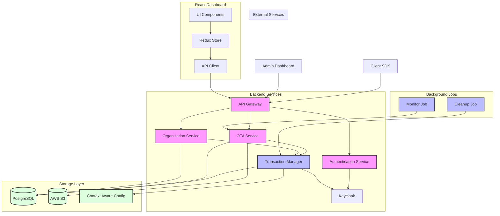

# Hyper OTA Server Architecture

## Overview
Hyper OTA Server is a backend service that supports SAAS offering of Hyper OTA SDK. It integrates with [Superposition](superposition/README.md) for configuration management and experimentation.

## System Architecture



## Core Components

### 1. Authentication & Authorization
- Uses Keycloak for identity management and access control
- Implements a hierarchical ACL system:
  - Organization Owner (highest access)
  - Organization Admin
  - Application Admin
  - Application Write
  - Application Read (lowest access)

### 2. API Endpoints

#### User Management
```http
GET /user
- Returns complete user state
- Queries Keycloak for access levels, organizations and applications

POST /user/login
- Handles OpenID Connect authentication via Keycloak
- Returns authentication token and user state

POST /user/create
- Creates new user account in Keycloak
- Uses service account credentials
```

#### Organization Management
```http
POST /organisation/create
- Creates organization group in Keycloak
- Sets up owner group and permissions
- Creates organization in Context-Aware Config (CAC)
- Maps Keycloak ID to CAC ID

POST /organisation/application/create 
- Creates application group under organization
- Sets up admin group and permissions
- Creates CAC workspace
- Initializes default configuration
```

#### Application Management
```http
POST /organisation/application/package/create
- Handles package uploads and file management

POST /organisation/application/release/create
- Manages configuration and resource updates

POST /organisation/application/release/abort
- Aborts active releases

POST /organisation/application/release/conclude
- Concludes active releases

POST /organisation/application/release/ramp
- Controls stagger percentage for releases
```

### 3. Data Storage

#### Database Schema
- Organizations Table
  - Maps organizations to Superposition orgs
  
- Packages Table
  ```
  id | version | app_id | org_id | index | version_splits | use_urls | contents | created_by | created_at
  ```

#### Default Configuration
```json
{
  "package.version": "Current live package version",
  "package.name": "Application name/display name",
  "config.package_timeout": "Package download timeout",
  "config.release_config_timeout": "Release config download timeout",
  "config.version": "Release config version"
}
```

### 4. Resource Isolation

- **Storage Isolation**: 
  - S3 Bucket structure: `asset/{org}/{app}/{version}/{file}`
  
- **Configuration Isolation**:
  - Separate CAC workspace per application
  
- **Database Isolation**:
  - Shared database with schema-level separation

### 5. Integration with Superposition

The server leverages Superposition for:
- Context-aware configuration management
- A/B testing and experimentation
- Configuration versioning and rollouts
- Multi-tenant configuration management

### 6. Security Features

- **Authentication**: OpenID Connect via Keycloak
- **Authorization**: Role-based access control
- **Service Accounts**: For automated/system operations
- **Tenant Isolation**: Multi-tenant architecture with proper isolation

### 7. CLI Support

Provides command-line tools for:
- File and release config generation
- Local development server
- SDK server management

### 8. Transaction Management

The system implements distributed transactions to maintain consistency across multiple services:

#### Key Components
- Keycloak (Identity Management)
- Superposition (Configuration Management) 
- PostgreSQL Database

#### Transaction Flow
1. **Initialize** - Create transaction ID and state
2. **Track Resources** - Monitor created resources across services
3. **Rollback** - Automatic cleanup if any step fails
4. **Cleanup** - Background job for failed cleanups

#### Safety Features
- Idempotent operations
- Automatic rollback
- Failed operation retry
- Transaction state tracking
- Ordered resource cleanup

This ensures atomic operations across distributed services while maintaining data consistency.

## Setup Requirements

1. Database Setup
2. Keycloak Configuration
3. Environment Variables
4. AWS/S3 Configuration
5. Superposition Integration

## Development Notes

### Local Development
```bash
# Database Setup
psql -U <user> -d postgres
CREATE DATABASE hyperotaserver OWNER <user>;
CREATE DATABASE config OWNER <user>;

# Run Migrations
diesel migration run
make db-init # in superposition
```

## Frontend Architecture

### 1. Technology Stack
- React with TypeScript
- Vite as build tool
- Redux for state management
- Tailwind CSS for styling
- Axios for API communication

### 2. Core Components

#### Authentication Components
```tsx
- Login.tsx: Handles user authentication
- Signup.tsx: New user registration
```

#### Layout Components
```tsx
- Header.tsx: Navigation and user info
- LoadingSpinner.tsx: Loading state indicator
- Toast.tsx: Notification system
```

#### Feature Components
```tsx
- Home.tsx: Dashboard landing page
- Release.tsx: Release management interface
- Organization/: Organization management components
```

### 3. State Management

#### Redux Store Structure
```typescript
- authSlice: Authentication state and tokens
- userSlice: User information and permissions
- toastSlice: Global notification system
```

### 4. API Integration
```typescript
- axios.ts: Configured Axios instance
- Interceptors for:
  - Authentication headers
  - Error handling
  - Response transformation
```

### 5. Project Structure
```
dashboard_react/
├── src/
│   ├── api/           # API integration
│   ├── components/    # React components
│   ├── store/         # Redux store
│   ├── utils/         # Utility functions
│   ├── types.ts       # TypeScript definitions
│   └── main.tsx       # Application entry
```

### 6. Features
- Protected routes based on user permissions
- Real-time notifications
- Responsive design
- Token-based authentication
- Organization management
- Release management and monitoring
- Package upload and version control

### 7. Build and Development

#### Local Development
```bash
cd dashboard_react
npm install
npm run dev
```

#### Production Build
```bash
npm run build
```

#### Environment Configuration
```env
VITE_API_URL=http://localhost:8000
VITE_KEYCLOAK_URL=http://localhost:8080
VITE_CLIENT_ID=your-client-id
```

This frontend architecture complements the backend system by providing:
- User-friendly interface for OTA operations
- Secure authentication flow
- Role-based access control
- Real-time release monitoring
- Organization and application management